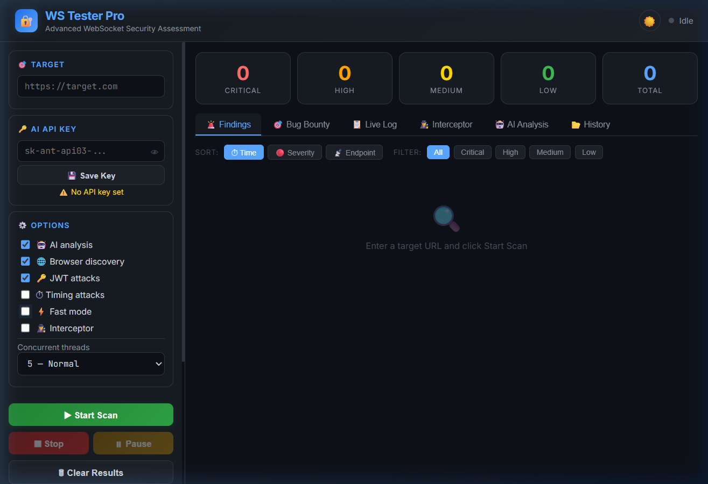
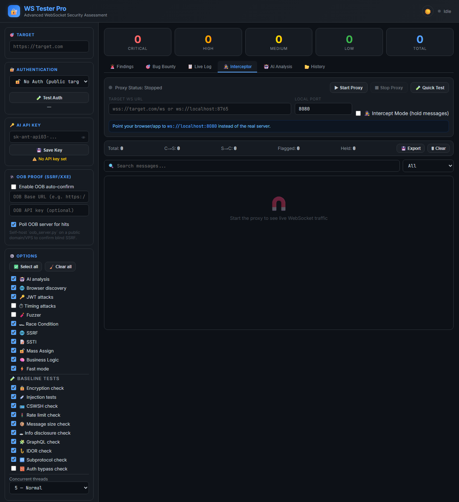

<p align="center">
  <h1 align="center">🔐 WS Tester Pro</h1>
  <p align="center"><b>Advanced WebSocket Security Assessment Tool</b></p>
  <p align="center">
    
    
    
  </p>
</p>

---

**WS Tester Pro** is a professional-grade WebSocket penetration testing tool with a real-time dashboard. It discovers WebSocket endpoints, runs 25+ automated security tests, and generates OWASP-format reports — all from your browser or the command line.

## 🎬 Features

| Feature | Description |
|---|---|
| 🚀 **Auto Scanner** | Discovers WS endpoints & runs 25+ vulnerability tests |
| 🎯 **Bug Bounty Mode** | One-click copy of HackerOne/Bugcrowd-ready markdown reports |
| 📄 **Multi-Format Reports** | PDF, HTML, JSON, and SARIF (CI/CD) export |
| 🤖 **AI Analysis** | Anthropic Claude integration for attack chain analysis |
| 🕵️ **Live Interceptor** | Capture, search, filter & replay WebSocket traffic |
| 🧨 **WebSocket Fuzzer** | Auto-detect crashes, DoS, and error leaks with malformed payloads |
| ⚡ **Fast/Deep Modes** | Quick scans or comprehensive audits |
| 🖥️ **CLI + Dashboard** | Use the web dashboard or scan from the command line |
| 🔄 **Concurrent Scanning** | Parallel endpoint testing (3/5/10 threads) |
| ⏸ **Pause & Resume** | Pause scans and resume without losing progress |
| 📊 **Session History** | Save, load, and compare scan sessions |
| 🌙 **Dark/Light Theme** | Toggle between themes with Ctrl+Shift+T |
| ⌨️ **Keyboard Shortcuts** | Fast workflow with keyboard shortcuts |
| 🔔 **Notifications** | Browser notifications + sound on scan complete |
| 📱 **Responsive UI** | Works on desktop, tablet, and mobile screens |

## 📸 Screenshots


*The main dashboard for configuring and launching WebSocket security scans.*


*Real-time traffic interceptor highlighting potentially malicious payloads.*

## 📁 Project Structure

```
ws_pro/
├── attacks/
│   ├── auth.py               # JWT attacks, CSWSH, auth bypass
│   ├── business_logic.py     # Business logic & workflow abuse tests
│   ├── fuzzer.py             # WebSocket fuzzer (DoS, boundary values, typings)
│   ├── injection.py          # SQLi, XSS, CMDi, NoSQL, Prototype Pollution
│   ├── mass_assignment.py    # Mass-assignment style issues
│   ├── network.py            # Encryption, info disclosure, GraphQL, IDOR
│   ├── race_condition.py     # Concurrency / race-condition tests
│   ├── ssrf.py               # SSRF-style payload tests
│   ├── ssti.py               # Server-side template injection tests
│   ├── subprotocol.py        # WebSocket subprotocol negotiation attacks
│   └── timing.py             # Timing-based side channels & user enumeration
├── core/
│   ├── scanner.py          # Endpoint discovery, fingerprinting, connection helpers
│   └── findings.py         # Thread-safe findings store, CVSS scoring
├── dashboard/
│   ├── app.py              # Flask + Socket.IO server
│   ├── templates/
│   │   └── index.html      # Dashboard UI
│   └── static/
│       ├── css/app.css     # Styling (dark/light themes, responsive)
│       └── js/app.js       # Frontend logic
├── docs/
│   ├── dashboard.png        # Screenshot
│   └── interceptor.png      # Screenshot
├── logs/                    # Runtime logs (created locally)
├── reports/
│   ├── generator.py        # HTML report generator (browser view)
│   ├── pdf_generator.py    # OWASP-format PDF report generator
│   └── sarif_generator.py  # SARIF v2.1.0 for CI/CD integration
├── tests/
│   ├── test_attacks.py      # Unit tests (pytest)
│   ├── test_core.py         # Unit tests (pytest)
│   └── test_integration.py  # Integration tests (pytest)
├── utils/
│   ├── evidence.py         # Evidence data collector
│   └── logger.py           # File + console logging
├── main.py                 # CLI entry point (argparse)
├── mock_server.py          # Vulnerable test server (13 scenarios)
├── test_ui.py              # UI smoke checks (local)
├── test_ws.py              # WebSocket connectivity checks (local)
├── test_results.txt        # Local test output (generated)
├── .env.example            # Environment configuration template
├── requirements.txt        # Python dependencies
├── venv/                   # Local virtualenv (recommended; not committed)
├── CONTRIBUTING.md         # Contribution guide
└── README.md               # This file
```

---

## 🖥️ Installation

### Prerequisites

- **Python 3.9+** — [Download Python](https://www.python.org/downloads/)
- **pip** — Comes bundled with Python
- A modern browser (Chrome, Firefox, Edge)

---

### 🪟 Windows

```powershell
# 1. Clone or download the project
cd C:\path\to\your\projects
git clone https://github.com/palnirupam/ws_pro.git ws_pro
cd ws_pro

# 2. (Recommended) Create a virtual environment
python -m venv venv
venv\Scripts\activate

# 3. Install dependencies
pip install -r requirements.txt

# 4. (Optional) Configure environment
copy .env.example .env
# Edit .env with your settings

# 5. Start the dashboard
python dashboard\app.py
```

Open your browser → **http://localhost:5000**

---

### 🍎 macOS

```bash
# 1. Clone or download the project
cd ~/projects
git clone https://github.com/palnirupam/ws_pro.git ws_pro
cd ws_pro

# 2. (Recommended) Create a virtual environment
python3 -m venv venv
source venv/bin/activate

# 3. Install dependencies
pip install -r requirements.txt

# 4. (Optional) Configure environment
cp .env.example .env

# 5. Start the dashboard
python3 dashboard/app.py
```

Open your browser → **http://localhost:5000**

---

### 🐧 Linux (Ubuntu/Debian)

```bash
# 1. Install Python if not already installed
sudo apt update && sudo apt install python3 python3-pip python3-venv -y

# 2. Clone or download the project
cd ~/projects
git clone https://github.com/palnirupam/ws_pro.git ws_pro
cd ws_pro

# 3. (Recommended) Create a virtual environment
python3 -m venv venv
source venv/bin/activate

# 4. Install dependencies
pip install -r requirements.txt

# 5. (Optional) Configure environment
cp .env.example .env

# 6. Start the dashboard
python3 dashboard/app.py
```

Open your browser → **http://localhost:5000**

---

## 🚀 Quick Start Guide

### Option A: Web Dashboard

```bash
# Windows
python dashboard\app.py

# macOS / Linux
python3 dashboard/app.py
```

You'll see:
```
╔══════════════════════════════════════╗
║     WS Tester Pro — Dashboard        ║
║     http://localhost:5000            ║
╚══════════════════════════════════════╝
```

### Option B: Command Line

```bash
# Basic scan
python main.py --target https://example.com

# Fast scan with JSON output
python main.py --target wss://example.com/ws --fast --output report.json

# SARIF output for CI/CD
python main.py --target https://example.com --output report.sarif --format sarif

# All options
python main.py --target https://target.com --timing --no-jwt --output findings.json

# Start dashboard from CLI
python main.py --dashboard
```

### Dashboard Workflow

1. Enter a WebSocket URL in the **🎯 Target** field (e.g. `wss://example.com/ws`)
2. Configure scan options (Fast mode, JWT attacks, Timing, etc.)
3. Click **▶ Start Scan** (or press `Ctrl+Enter`)
4. View results in tabs: Findings | Bug Bounty | Live Log | Interceptor | AI Analysis | History
5. Export reports: **📄 Download PDF** (hover for more formats: HTML, SARIF, JSON)

### 💡 Example Penetration Testing Session

Here is how a typical assessment flows using WS Tester Pro:

1. **Discovery & Recon**: You connect to a target application, right-click, select "Inspect", and go to the "Network" tab, then filter by "WS". You spot a connection to `wss://api.target.com/v1/chat`.
2. **Initial Scan**: You open WS Tester Pro, paste the URL into the **Target** field, select **Fast mode**, and click Start.
3. **Deep Analysis**: The Fast mode scan returns an "Authentication Bypass" finding. Unchecking Fast mode, you select the **JWT attacks** flag and re-run the scan to perform a deep analysis of how their tokens are verified.
4. **Traffic Interception**: To understand exactly how the payload works, you switch to the **Interceptor** mode, configure the proxy, and capture the exact traffic flowing during the exploit.
5. **Reporting**: You switch to the **Bug Bounty** tab, click **Copy** next to the critical finding, and paste the markdown directly into your bug report. Finally, you download a PDF report using the **📄 Download PDF** button to share with the client.

---

## ⌨️ Keyboard Shortcuts

| Shortcut | Action |
|---|---|
| `Ctrl+Enter` | Start scan |
| `Escape` | Stop scan |
| `Ctrl+Shift+T` | Toggle dark/light theme |
| `Ctrl+Shift+S` | Save current session |
| `Ctrl+Shift+E` | Export findings as JSON |
| `Alt+1` to `Alt+6` | Switch between tabs |

---

## 🎯 Bug Bounty Workflow

1. Run a comprehensive scan on your target WebSocket endpoint.
2. Once the scan is complete, switch to the **🎯 Bug Bounty** tab in the dashboard.
3. Review the list of discovered vulnerabilities.
4. Click the **📋 Copy** button next to any finding. This automatically generates a professional markdown report formatted perfectly for platforms like HackerOne, Bugcrowd, or YesWeHack.
5. The generated report includes:
   - Vulnerability Name & Severity
   - CVSS Score and Vector
   - Target URL & Exact Endpoint
   - Detailed Description & Impact Statement
   - Step-by-Step Reproduction Guide
   - Extracted Evidence/Payloads
   - Remediation Advice
6. Paste the copied text directly into your vulnerability submission form and submit!

---

## 🕵️ Interceptor Mode Guide

The Interceptor allows you to act as a proxy between your client and a target WebSocket server, capturing traffic in real-time and automatically flagging suspicious payloads.

1. In the sidebar, check the **🕵️ Interceptor** box under Options.
2. The **Interceptor Config** card will appear. Enter the target WebSocket URL you want to connect to (e.g. `ws://target.com/chat`).
3. Click **▶ Start Proxy**. The proxy will connect to the target.
4. Switch to the **🕵️ Interceptor** tab in the main view.
5. You will see traffic flowing in real-time. Messages are grouped by direction (`CLIENT→SERVER`, `SERVER→CLIENT`).
6. **Key Features**:
   - **⚠️ FLAGGED Tags**: Payloads matching common attack patterns (SQLi, XSS, Path Traversal, JWTs) are highlighted in red automatically.
   - **Search & Filter**: Type in the search box to find specific strings, or use the dropdown to view only Client or Server messages.
   - **JSON Highlighting**: Valid JSON messages are automatically syntax-highlighted.
   - **Export**: Click the **💾 Export** button to save the entire capture session as a JSON file for later analysis.

---

## 🤖 AI Analysis Setup (Optional)

To enable AI-powered analysis using Anthropic Claude:

1. Get an API key from [console.anthropic.com](https://console.anthropic.com/)
2. **Option A**: Add to `.env` file: `ANTHROPIC_API_KEY=sk-ant-api03-...`
3. **Option B**: In the dashboard sidebar, paste your key in **🔑 AI API Key** and click **💾 Save Key**
4. Enable **🤖 AI analysis** checkbox before scanning

> The key loaded from `.env` persists across restarts. Keys entered in the dashboard are only stored in memory during the session.

---

## ⚙️ Environment Configuration

Copy `.env.example` to `.env` and configure:

```env
# Flask secret key (auto-generated if not set)
WS_SECRET_KEY=your-secret-key-here

# Anthropic API key for AI analysis
ANTHROPIC_API_KEY=sk-ant-api03-your-key-here

# CORS allowed origins (comma-separated, default: * for all)
WS_CORS_ORIGINS=http://localhost:5000,http://localhost:3000
```

---

## ⚙️ Scan Options

| Option | Description |
|---|---|
| 🤖 **AI analysis** | Send findings to Claude for attack chain analysis |
| 🌐 **Browser discovery** | Use headless browser to find hidden WS endpoints |
| 🔑 **JWT attacks** | Test 7 types of JWT vulnerabilities |
| ⏱ **Timing attacks** | Detect timing-based side channels & user enumeration |
| 🧨 **Fuzzer** | Send malformed/boundary payloads to detect crashes & leaks |
| ⚡ **Fast mode** | Skip deep tests for quicker results |
| 🕵️ **Interceptor** | Capture live WebSocket traffic via proxy |
| **Concurrent threads** | 3 (Safe) / 5 (Normal) / 10 (Aggressive) |

---

## 📊 Export Formats

| Format | Use Case |
|---|---|
| **PDF** | Professional OWASP-format reports for clients |
| **HTML** | Standalone viewable report in any browser |
| **JSON** | Machine-readable, import/export between sessions |
| **SARIF** | CI/CD integration (GitHub Actions, Azure DevOps) |

---

## 🔒 Security Tests Performed

- JWT None Algorithm Attack
- JWT Algorithm Confusion
- JWT Token Manipulation
- Authentication Bypass
- Rate Limiting

### Network Tests
- Encryption Check (ws:// vs wss://)
- Message Size Limits
- Information Disclosure
- GraphQL Introspection
- IDOR (Insecure Direct Object Reference)

### Timing Tests
- Timing-Based User Enumeration
- Query Timing Side Channels

### Fuzzer Tests
- Oversized Payloads (Buffer Overflows)
- Malformed JSON / Invalid Parsing
- Special Byte Injections (Null Bytes, Controls)
- Type Confusion (Arrays vs Dicts vs Strings)
- Boundary Value Fuzzing

### Protocol Tests
- WebSocket Subprotocol Validation
- Protocol Confusion / Downgrade

---

## 🧪 Testing

```bash
# Run unit tests
pytest tests/ -v

# Run with the mock vulnerable server
python mock_server.py    # Terminal 1
python main.py --target ws://localhost:8765    # Terminal 2
```

The mock server simulates 13 vulnerability scenarios including SQL injection, XSS, command injection, IDOR, JWT bypass, timing oracle, and more.

### 🐧 Testing on Kali Linux (Local Mock Server)

If you want to test the tool's scanning capabilities on your Kali Linux machine, you can use the built-in vulnerable mock server and the web dashboard:

1. **Start the Mock Server (Target)**
   Open a terminal, activate your virtual environment, and run:
   ```bash
   source venv/bin/activate
   python3 mock_server.py
   ```
   *This starts a vulnerable WebSocket server on `ws://localhost:8765`.*

2. **Start the Dashboard (Scanner)**
   Open a **new, second terminal window**, activate the environment, and run:
   ```bash
   source venv/bin/activate
   python3 dashboard/app.py
   ```
   *This starts the scanner UI on `http://localhost:5000`.*

3. **Run the Scan**
   - Open your browser and go to `http://localhost:5000`
   - In the **Target** field, enter: `ws://localhost:8765`
   - Select **Deep Scan** (uncheck Fast mode) and click **Start Scan**.
   - Watch the dashboard identify SQLi, XSS, CSWSH and other vulnerabilities in real-time!


---

## 📋 VS Code Setup

1. Open the `ws_pro` folder in VS Code
2. Open a terminal (`Ctrl + ~` or Terminal → New Terminal)
3. Run:
   ```bash
   pip install -r requirements.txt
   python dashboard/app.py         # or python3 on Mac/Linux
   ```
4. `Ctrl+Click` the URL `http://localhost:5000` in the terminal to open in browser

---

## ⚠️ Legal Disclaimer

> **This tool is intended for educational purposes and authorized security testing only.**
> 
> The developers and contributors of **WS Tester Pro** assume no liability and are not responsible for any misuse or damage caused by this program. It is the end user's absolute responsibility to obey all applicable local, state, and federal laws.
> 
> You may **ONLY** use this tool on systems, networks, and applications that you own, or for which you have explicit, written permission from the owner to conduct security assessments. Unauthorized scanning of systems or exploiting vulnerabilities without consent is illegal and may result in severe civil and criminal penalties.
> 
> By using this tool, you agree that you are using it at your own risk and that the creators will not be held accountable for your actions.

---

## 📄 License

**GNU AGPL v3 License** — Free for personal, academic, and open-source use.

If you modify or use this software as part of a service (SaaS), you **must** release your modifications under the same AGPL v3 license and make the source code available to your users. See the [LICENSE](LICENSE) file for more details.
