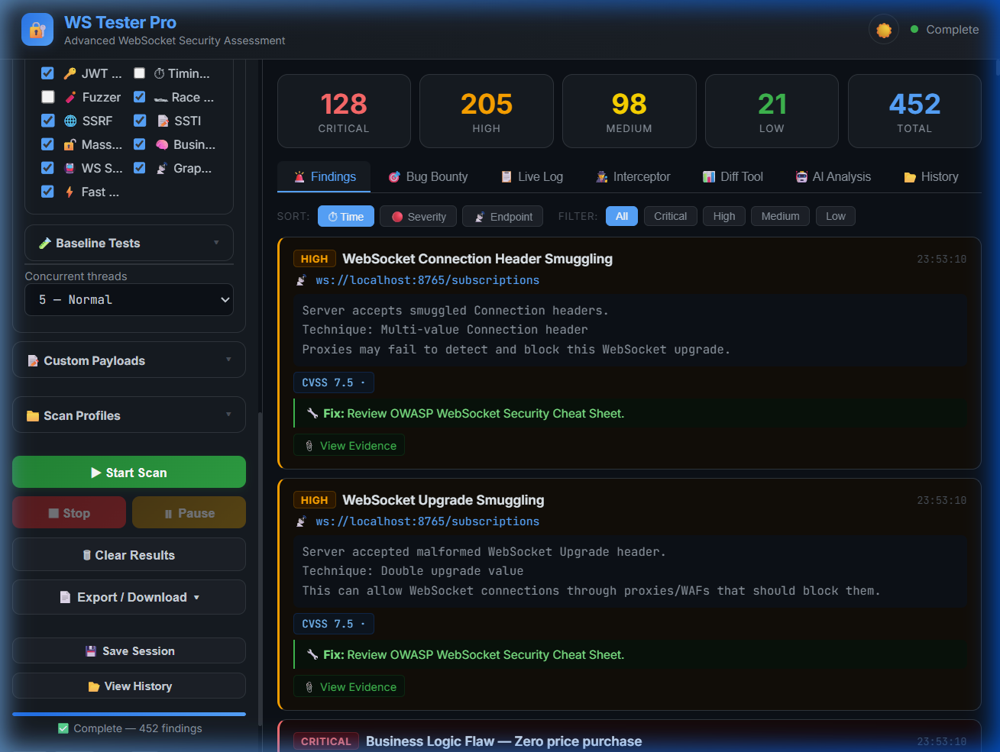
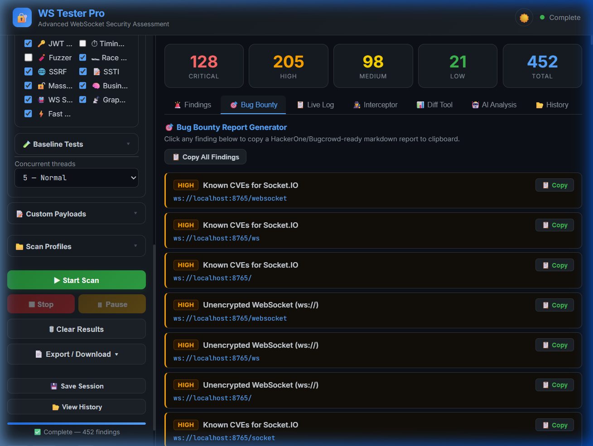
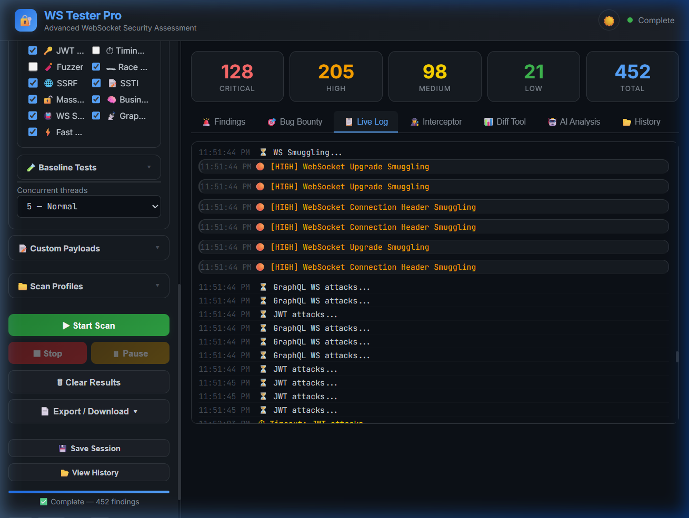
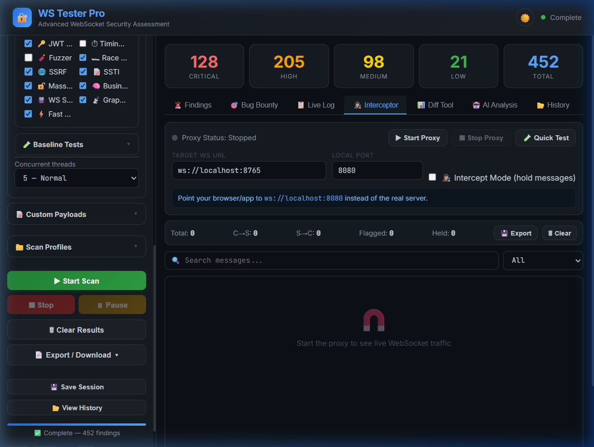
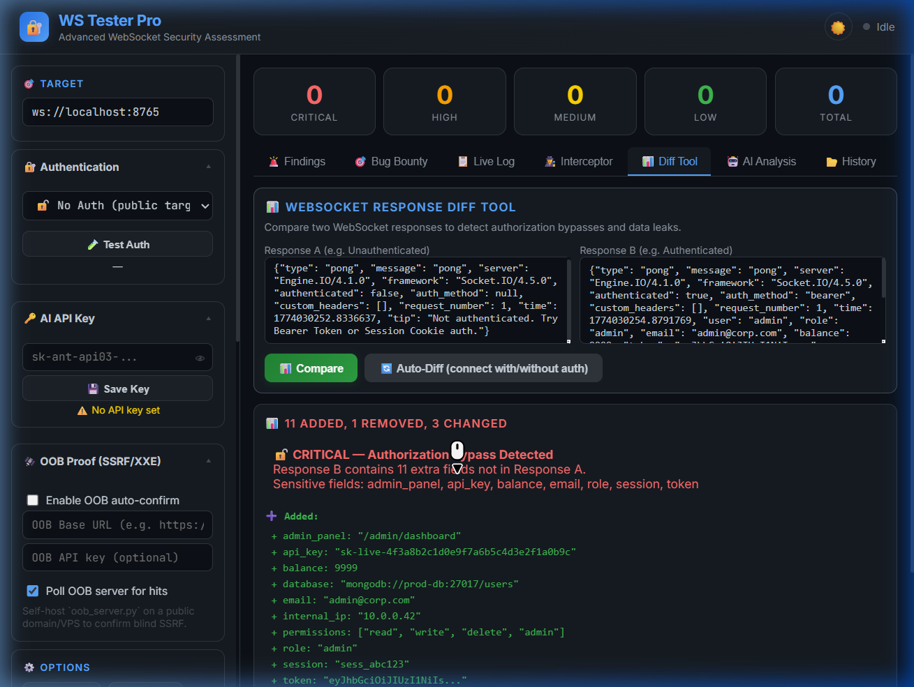
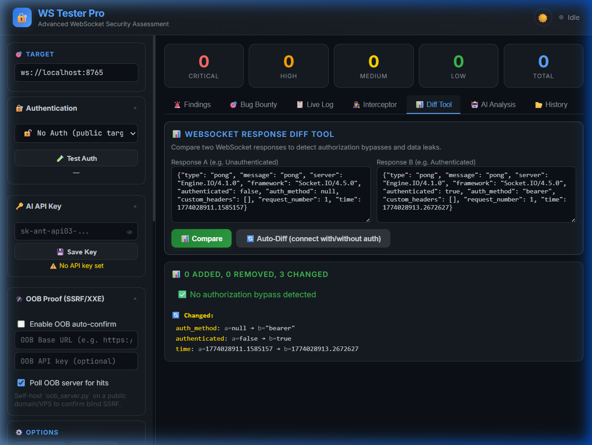

<p align="center">
  <h1 align="center">🔐 WS Tester Pro</h1>
  <p align="center"><b>Advanced WebSocket Security Assessment Tool</b></p>
  <p align="center">
    
    
    
  </p>
</p>

---

**WS Tester Pro** is a professional-grade WebSocket penetration testing tool with a real-time dashboard. It discovers WebSocket endpoints, runs 25+ automated security tests, and generates OWASP-format reports — all from your browser or the command line.

> **Docker is optional.** If you don't have Docker installed (e.g. you see: `docker : The term 'docker' is not recognized`), you can still run everything with **Python** using the **Installation** / **Quick Start** steps below.  
> Docker/Compose is only for easy hosting (running Dashboard + OOB server together).

## 🎬 Features

| Feature | Description |
|---|---|
| 🚀 **Auto Scanner** | Discovers WS endpoints & runs 25+ vulnerability tests |
| 🔐 **Authenticated Scan** | Reuse login (token/cookie/headers) to scan protected WebSockets |
| 📊 **Response Diff Tool** | Compare authenticated vs unauthenticated WebSocket responses to detect authorization bypass & data leaks |
| 🔄 **Auto-Diff** | One-click automated dual-connection diffing — connects with & without auth, flags sensitive field leaks |
| 🎯 **Bug Bounty Mode** | One-click copy of HackerOne/Bugcrowd-ready markdown reports |
| 📄 **Multi-Format Reports** | PDF, HTML, JSON, and SARIF (CI/CD) export |
| 🤖 **AI Analysis** | Anthropic Claude integration for attack chain analysis |
| 🕵️ **Live Interceptor / MITM Proxy** | Real WebSocket man-in-the-middle proxy to capture, filter & replay live traffic |
| 🧨 **WebSocket Fuzzer** | Auto-detect crashes, DoS, and error leaks with malformed payloads |
| ⚡ **Fast/Deep Modes** | Quick scans or comprehensive audits |
| 🖥️ **CLI + Dashboard** | Use the web dashboard or scan from the command line |
| 🔄 **Concurrent Scanning** | Parallel endpoint testing (3/5/10 threads) |
| ⏸ **Pause & Resume** | Pause scans and resume without losing progress |
| 📊 **Session History** | Save, load, and compare scan sessions |
| 🌙 **Dark/Light Theme** | Toggle between themes with Ctrl+Shift+T |
| ⌨️ **Keyboard Shortcuts** | Fast workflow with keyboard shortcuts |
| 🔔 **Notifications** | Browser notifications + sound on scan complete |
| 📱 **Responsive UI** | Works on desktop, tablet, and mobile screens |

## 📸 Screenshots

### 🔍 Scan Results — Findings Tab

*452 vulnerabilities discovered with severity breakdown: 128 Critical, 205 High, 98 Medium, 21 Low.*

### 🎯 Bug Bounty Report Generator

*Copy HackerOne/Bugcrowd-ready markdown reports with one click — each finding includes CVSS scores, reproduction steps, and remediation.*

### 📡 Live Scan Log

*Real-time scan activity with color-coded severity levels, timestamps, and module-by-module progress tracking.*

### 🕵️ MITM Interceptor

*WebSocket man-in-the-middle proxy with traffic capture, search, filter, hold/forward/drop, and replay capabilities.*

### 📊 Auto-Diff — Bypass Detection

*Auto-Diff detecting CRITICAL authorization bypass: 11 sensitive fields leaked including API keys, admin panel paths, database URIs, and internal IPs.*

### ✅ Auto-Diff — Clean Comparison

*Authenticated vs unauthenticated response comparison — no bypass detected when the server correctly enforces authorization.*

## 📁 Project Structure

```
ws_pro/
├── attacks/
│   ├── auth.py               # JWT attacks, CSWSH, auth bypass
│   ├── business_logic.py     # Business logic & workflow abuse tests
│   ├── fuzzer.py             # WebSocket fuzzer (DoS, boundary values, typings)
│   ├── injection.py          # SQLi, XSS, CMDi, NoSQL, Prototype Pollution
│   ├── mass_assignment.py    # Mass-assignment style issues
│   ├── network.py            # Encryption, info disclosure, GraphQL, IDOR
│   ├── race_condition.py     # Concurrency / race-condition tests
│   ├── ssrf.py               # SSRF-style payload tests
│   ├── ssti.py               # Server-side template injection tests
│   ├── subprotocol.py        # WebSocket subprotocol negotiation attacks
│   └── timing.py             # Timing-based side channels & user enumeration
├── core/
│   ├── scanner.py          # Endpoint discovery, fingerprinting, connection helpers
│   ├── ws_proxy.py         # Real WebSocket MITM proxy (bridge + intercept/hold + replay)
│   └── findings.py         # Thread-safe findings store, CVSS scoring
├── dashboard/
│   ├── app.py              # Flask + Socket.IO server
│   ├── templates/
│   │   └── index.html      # Dashboard UI
│   └── static/
│       ├── css/app.css     # Styling (dark/light themes, responsive)
│       └── js/app.js       # Frontend logic
├── docs/
│   ├── dashboard.png              # Legacy screenshot
│   ├── interceptor.png            # Legacy screenshot
│   └── screenshots/
│       ├── findings.png                   # Findings tab with scan results
│       ├── bug_bounty.png                 # Bug Bounty report generator
│       ├── live_log.png                   # Live scan activity log
│       ├── interceptor.png                # MITM proxy UI
│       ├── auto_diff_bypass_detection.png # Auto-Diff CRITICAL bypass demo
│       └── auto_diff_results.png          # Auto-Diff clean result demo
├── logs/                    # Runtime logs (created locally)
├── reports/
│   ├── generator.py        # HTML report generator (browser view)
│   ├── pdf_generator.py    # OWASP-format PDF report generator
│   └── sarif_generator.py  # SARIF v2.1.0 for CI/CD integration
├── tests/
│   ├── test_attacks.py      # Unit tests (pytest)
│   ├── test_core.py         # Unit tests (pytest)
│   └── test_integration.py  # Integration tests (pytest)
├── utils/
│   ├── evidence.py         # Evidence data collector
│   └── logger.py           # File + console logging
├── main.py                 # CLI entry point (argparse)
├── mock_server.py          # Vulnerable test server (15+ scenarios, auth-aware responses)
├── test_ui.py              # UI smoke checks (local)
├── test_ws.py              # WebSocket connectivity checks (local)
├── .env.example            # Environment configuration template
├── requirements.txt        # Python dependencies
├── venv/                   # Local virtualenv (recommended; not committed)
├── CONTRIBUTING.md         # Contribution guide
└── README.md               # This file
```

---

## 🖥️ Installation

### Prerequisites

- **Python 3.9+** — [Download Python](https://www.python.org/downloads/)
- **pip** — Comes bundled with Python
- A modern browser (Chrome, Firefox, Edge)

---

### 🪟 Windows

```powershell
# 1. Clone or download the project
cd C:\path\to\your\projects
git clone https://github.com/palnirupam/ws_pro.git ws_pro
cd ws_pro

# 2. (Recommended) Create a virtual environment
python -m venv venv
venv\Scripts\activate

# 3. Install dependencies
pip install -r requirements.txt

# 4. (Optional) Configure environment
copy .env.example .env
# Edit .env with your settings

# 5. Start the dashboard
python dashboard\app.py
```

Open your browser → **http://localhost:5000**

---

### 🍎 macOS

```bash
# 1. Clone or download the project
cd ~/projects
git clone https://github.com/palnirupam/ws_pro.git ws_pro
cd ws_pro

# 2. (Recommended) Create a virtual environment
python3 -m venv venv
source venv/bin/activate

# 3. Install dependencies
pip install -r requirements.txt

# 4. (Optional) Configure environment
cp .env.example .env

# 5. Start the dashboard
python3 dashboard/app.py
```

Open your browser → **http://localhost:5000**

---

### 🐧 Linux (Ubuntu/Debian)

```bash
# 1. Install Python if not already installed
sudo apt update && sudo apt install python3 python3-pip python3-venv -y

# 2. Clone or download the project
cd ~/projects
git clone https://github.com/palnirupam/ws_pro.git ws_pro
cd ws_pro

# 3. (Recommended) Create a virtual environment
python3 -m venv venv
source venv/bin/activate

# 4. Install dependencies
pip install -r requirements.txt

# 5. (Optional) Configure environment
cp .env.example .env

# 6. Start the dashboard
python3 dashboard/app.py
```

Open your browser → **http://localhost:5000**

---

## 🚀 Quick Start Guide

### Option A: Web Dashboard

```bash
# Windows
python dashboard\app.py

# macOS / Linux
python3 dashboard/app.py
```

You'll see:
```
╔══════════════════════════════════════╗
║     WS Tester Pro — Dashboard        ║
║     http://localhost:5000            ║
╚══════════════════════════════════════╝
```

### 🔐 Authenticated Scan (Dashboard)

Most real WebSockets are behind login. Use the **🔐 Authentication** card in the sidebar to reuse credentials for **all** WebSocket connections during the scan:

- **Username + Password**: auto-login and extract token/cookies
- **Bearer token**: attach `Authorization: Bearer ...` to every WS connect
- **Session cookie**: attach `Cookie: ...` to every WS connect
- **Custom headers**: attach arbitrary headers (one per line: `Name: Value`)

Use **🧪 Test Auth** to validate credentials before scanning.

> Safety: the UI has a **10s timeout** so "Testing..." can’t get stuck forever.

### Option B: Command Line

```bash
# Basic scan
python main.py --target https://example.com

# Fast scan with JSON output
python main.py --target wss://example.com/ws --fast --output report.json

# SARIF output for CI/CD
python main.py --target https://example.com --output report.sarif --format sarif

# All options
python main.py --target https://target.com --timing --no-jwt --output findings.json

# Authenticated scan (CLI)
python main.py --target https://app.com --username admin --password pass123
python main.py --target https://app.com --token eyJhbGci...
python main.py --target https://app.com --cookie "session=abc123; csrf=xyz"

# Start dashboard from CLI
python main.py --dashboard
```

### Dashboard Workflow

1. Enter a WebSocket URL in the **🎯 Target** field (e.g. `wss://example.com/ws`)
2. (Optional) Configure **🔐 Authentication**:
   - Username + Password (auto-login, token/cookie reuse)
   - Bearer token
   - Session cookie
   - Custom headers
3. Configure scan options (Fast mode, JWT attacks, Timing, etc.)
4. Click **▶ Start Scan** (or press `Ctrl+Enter`)
5. View results in tabs: Findings | Bug Bounty | Live Log | Interceptor | **Diff Tool** | AI Analysis | History
6. Export reports: **📄 Download PDF** (hover for more formats: HTML, SARIF, JSON)

### 💡 Example Penetration Testing Session

Here is how a typical assessment flows using WS Tester Pro:

1. **Discovery & Recon**: You connect to a target application, right-click, select "Inspect", and go to the "Network" tab, then filter by "WS". You spot a connection to `wss://api.target.com/v1/chat`.
2. **Initial Scan**: You open WS Tester Pro, paste the URL into the **Target** field, select **Fast mode**, and click Start.
3. **Deep Analysis**: The Fast mode scan returns an "Authentication Bypass" finding. Unchecking Fast mode, you select the **JWT attacks** flag and re-run the scan to perform a deep analysis of how their tokens are verified.
4. **Traffic Interception**: To understand exactly how the payload works, you switch to the **Interceptor** mode, configure the proxy, and capture the exact traffic flowing during the exploit.
5. **Reporting**: You switch to the **Bug Bounty** tab, click **Copy** next to the critical finding, and paste the markdown directly into your bug report. Finally, you download a PDF report using the **📄 Download PDF** button to share with the client.

---

## ⌨️ Keyboard Shortcuts

| Shortcut | Action |
|---|---|
| `Ctrl+Enter` | Start scan |
| `Escape` | Stop scan |
| `Ctrl+Shift+T` | Toggle dark/light theme |
| `Ctrl+Shift+S` | Save current session |
| `Ctrl+Shift+E` | Export findings as JSON |
| `Alt+1` to `Alt+6` | Switch between tabs |

---

## 🎯 Bug Bounty Workflow

1. Run a comprehensive scan on your target WebSocket endpoint.
2. Once the scan is complete, switch to the **🎯 Bug Bounty** tab in the dashboard.
3. Review the list of discovered vulnerabilities.
4. Click the **📋 Copy** button next to any finding. This automatically generates a professional markdown report formatted perfectly for platforms like HackerOne, Bugcrowd, or YesWeHack.
5. The generated report includes:
   - Vulnerability Name & Severity
   - CVSS Score and Vector
   - Target URL & Exact Endpoint
   - Detailed Description & Impact Statement
   - Step-by-Step Reproduction Guide
   - Extracted Evidence/Payloads
   - Remediation Advice
6. Paste the copied text directly into your vulnerability submission form and submit!

---

## 🕵️ Interceptor Mode Guide

WS Tester Pro includes a **real WebSocket MITM proxy** that sits between your client and the target server:

`Client/App → ws://localhost:<LOCAL_PORT> → [WS Tester Pro Proxy] → <TARGET_WS_URL>`

### Start the proxy (Dashboard)
1. Open the dashboard: **http://localhost:5000**
2. Go to the **Interceptor** tab
3. Set:
   - **Target WS URL**: the real server (example: `wss://example.com/ws`)
   - **Local Port**: where the proxy will listen (default: `8080`)
   - **Intercept Mode** (optional): hold messages for manual review
4. Click **Start Proxy**
5. Point your app/browser to **`ws://localhost:<LOCAL_PORT>`** instead of the real server.

### Live feed (Capture / Search / Export)
- Messages show **time**, **direction**, **size**, and **flags**.
- Use **Search** and **direction filter** to narrow down traffic.
- Click **Export** to download captured messages as JSON.

### Intercept Mode (Hold → Forward / Modify / Drop)
When **Intercept Mode** is enabled, messages are marked **HELD** and appear in **Held Messages**:
- **Forward**: send as-is to the other side
- **Modify & Forward**: edit payload and send
- **Drop**: discard the message (not forwarded)

**Important notes (expected behavior):**
- When **Intercept Mode** is ON, messages can be intentionally held, so the client/app may look like it’s **loading/stuck** until you click **Forward** or **Drop**.
- Holding **SERVER→CLIENT** messages can block client UI updates. For safer first tests, start by intercepting workflows where you mainly need to tamper **CLIENT→SERVER** messages (the proxy can hold both directions).

### Replay
- Each captured row has a **Replay** action.
- Replay sends the payload back to the target **(client→server)** through the proxy.
- “System/error” rows (e.g. target unreachable) don’t contain real payloads and can’t be replayed.

---

## 📊 Response Diff Tool

The **Diff Tool** tab lets you compare two WebSocket responses side by side to detect **authorization bypass** and **sensitive data leakage** — a critical check during pen testing.

### Manual Compare

1. Open the **Diff Tool** tab
2. Paste an **unauthenticated** WebSocket response into **Response A**
3. Paste an **authenticated** WebSocket response into **Response B**
4. Click **🔒 Compare**

The tool will:
- Parse both JSON responses
- Highlight **added**, **removed**, and **changed** fields
- Flag **sensitive fields** (`password`, `token`, `role`, `email`, `balance`, `session`, `api_key`, `internal_ip`)
- Show a **CRITICAL** banner if an authorization bypass is detected

### Auto-Diff (One-Click)

The **Auto-Diff** button automates the entire process:

1. Enter a **target WebSocket URL** in the sidebar (e.g. `ws://localhost:8765`)
2. Go to **Diff Tool** tab
3. Click **🔄 Auto-Diff (connect with/without auth)**

The backend will:
- Connect to the target **without authentication** → capture Response A
- Obtain a JWT token from the login endpoint (port + 1)
- Connect **with the auth token** → capture Response B
- Perform a field-by-field JSON diff
- Display the results with bypass severity analysis

**Example output (against mock server):**

```
🔓 CRITICAL — Authorization Bypass Detected
Response B contains 11 extra fields not in Response A.
Sensitive fields: admin_panel, api_key, balance, email, role, session, token

+ admin_panel: "/admin/dashboard"
+ api_key: "sk-live-4f3a8b2c1d0e9f7a6b5c4d3e2f1a0b9c"
+ balance: 9999
+ database: "mongodb://prod-db:27017/users"
+ email: "admin@corp.com"
+ internal_ip: "10.0.0.42"
+ permissions: ["read", "write", "delete", "admin"]
+ role: "admin"
+ session: "sess_abc123"
+ token: "eyJhbGciOiJIUzI1NiIs..."
+ user: "admin"
```


> **Use Case**: During a pentest, use Auto-Diff to quickly verify whether unauthenticated WebSocket connections can access authenticated-only data — a common vulnerability in real-world applications.

---

## 🤖 AI Analysis Setup (Optional)

To enable AI-powered analysis using Anthropic Claude:

1. Get an API key from [console.anthropic.com](https://console.anthropic.com/)
2. **Option A**: Add to `.env` file: `ANTHROPIC_API_KEY=sk-ant-api03-...`
3. **Option B**: In the dashboard sidebar, paste your key in **🔑 AI API Key** and click **💾 Save Key**
4. Enable **🤖 AI analysis** checkbox before scanning

> The key loaded from `.env` persists across restarts. Keys entered in the dashboard are only stored in memory during the session.

---

## ⚙️ Environment Configuration

Copy `.env.example` to `.env` and configure:

```env
# Flask secret key (auto-generated if not set)
WS_SECRET_KEY=your-secret-key-here

# Anthropic API key for AI analysis
ANTHROPIC_API_KEY=sk-ant-api03-your-key-here

# CORS allowed origins (comma-separated, default: * for all)
WS_CORS_ORIGINS=http://localhost:5000,http://localhost:3000
```

---

## 🛰️ OOB Proof (Blind SSRF/XXE Confirmation)

WS Tester Pro supports **OOB proof** to confirm **blind SSRF** (and future OOB-style checks) using a self-hosted callback server.

### Why OOB?
Some vulnerabilities are **blind**: the target executes your payload, but does not return any visible data in the WebSocket response.  
With OOB proof, the server makes a request to your callback URL, giving **strong, timestamped evidence**.

### Self-host the OOB server (recommended for real-world use)

The repo includes `oob_server.py` (HTTP callback server + events API).

**Run locally (dev):**

```bash
export OOB_API_KEY="change-me"
python3 oob_server.py
```

The callback endpoint is:
- `GET/POST /c/<token>` (records hits)

The polling API is:
- `GET /api/events/<token>` (requires `X-OOB-Key: <OOB_API_KEY>` by default)

**Important defaults (production-safe):**
- `/api/*` is **locked by default** unless you set `OOB_API_OPEN=1` (not recommended on Internet)
- events are persisted to `logs/oob_events.sqlite3`
- old events are purged using `OOB_TOKEN_TTL_SECONDS` (default 7 days)
- basic callback rate-limit by IP: `OOB_RATE_LIMIT_PER_MIN` (default 120/min)

### Configure dashboard to use OOB
In the sidebar:
- Enable **🛰️ OOB Proof**
- Set **OOB Base URL**: `https://oob.yourdomain.com/`
- Set **OOB API key**: same value as `OOB_API_KEY`
- Keep polling ON for auto-confirm

### Configure CLI to use OOB

```bash
python3 main.py --target wss://example.com/ws --oob https://oob.yourdomain.com/ --oob-key change-me
```

---

## 🐳 Docker (recommended for hosting)

This project ships with `docker-compose.yml` to run both:
- the Dashboard (port **5000**)
- the OOB server (port **7000**)

```bash
# From repo root
docker compose up -d --build
```

Common commands:

```bash
# View logs
docker compose logs -f

# Restart services
docker compose restart

# Stop (keep volumes)
docker compose down
```

Open:
- Dashboard: `http://localhost:5000`
- OOB health: `http://localhost:7000/health`

### Hosting notes (to avoid problems)
- Put both services behind **HTTPS** using a reverse proxy (Nginx/Caddy/Traefik).
- Keep `OOB_API_KEY` secret. Do not expose `/api/*` without auth.
- Set `WS_CORS_ORIGINS` to your dashboard domain in production (avoid `*` if exposed publicly).
- If running behind a proxy and you want correct client IPs in OOB logs, set `OOB_TRUST_PROXY=1`.

---

## ⚙️ Scan Options

| Option | Description |
|---|---|
| 🤖 **AI analysis** | Send findings to Claude for attack chain analysis |
| 🌐 **Browser discovery** | Use headless browser to find hidden WS endpoints |
| 🔑 **JWT attacks** | Test 7 types of JWT vulnerabilities |
| ⏱ **Timing attacks** | Detect timing-based side channels & user enumeration |
| 🧨 **Fuzzer** | Send malformed/boundary payloads to detect crashes & leaks |
| ⚡ **Fast mode** | Skip deep tests for quicker results |
| 🕵️ **Interceptor** | Capture live WebSocket traffic via proxy |
| 🔐 **Authentication** | Username+Password login, Bearer token, cookie, or custom headers for authenticated scans |
| **Concurrent threads** | 3 (Safe) / 5 (Normal) / 10 (Aggressive) |

**Attack controls (Dashboard):**
- The dashboard exposes **per-attack checkboxes**, including the baseline checks (Encryption/Injection/CSWSH/RateLimit/MsgSize/InfoDisclosure/GraphQL/IDOR/Subprotocol) and **Auth bypass**.
- Use **Select all / Clear all** in the Options panel to quickly enable/disable everything (useful for policy-safe scanning).

---

## 📊 Export Formats

| Format | Use Case |
|---|---|
| **PDF** | Professional OWASP-format reports for clients |
| **HTML** | Standalone viewable report in any browser |
| **JSON** | Machine-readable, import/export between sessions |
| **SARIF** | CI/CD integration (GitHub Actions, Azure DevOps) |

---

## 🔒 Security Tests Performed

- JWT None Algorithm Attack
- JWT Algorithm Confusion
- JWT Token Manipulation
- Authentication Bypass
- Rate Limiting

### Network Tests
- Encryption Check (ws:// vs wss://)
- Message Size Limits
- Information Disclosure
- GraphQL Introspection
- IDOR (Insecure Direct Object Reference)

### Timing Tests
- Timing-Based User Enumeration
- Query Timing Side Channels

### Fuzzer Tests
- Oversized Payloads (Buffer Overflows)
- Malformed JSON / Invalid Parsing
- Special Byte Injections (Null Bytes, Controls)
- Type Confusion (Arrays vs Dicts vs Strings)
- Boundary Value Fuzzing

### Protocol Tests
- WebSocket Subprotocol Validation
- Protocol Confusion / Downgrade

---

## 🧪 Testing

```bash
# Run unit tests
pytest tests/ -v

# Run with the mock vulnerable server
python mock_server.py    # Terminal 1
python main.py --target ws://localhost:8765    # Terminal 2
```

### Proxy quick test (Mock server)
1. Terminal 1:
   - `python mock_server.py` (WebSocket: `ws://localhost:8765`)
2. Terminal 2:
   - `python dashboard/app.py` (Dashboard: `http://localhost:5000`)
3. In the dashboard → **Interceptor** tab:
   - Target WS URL: `ws://localhost:8765`
   - Local Port: `8080`
   - Intercept Mode: **OFF** (first test)
   - Click **Start Proxy**
4. Click **🧪 Quick Test** (generates proxy traffic)

### Windows port troubleshooting
If you see “address already in use” or “connection refused”, check which PID is using a port:

```powershell
netstat -ano | findstr ":5000"
netstat -ano | findstr ":8080"
netstat -ano | findstr ":8765"
netstat -ano | findstr ":8766"

taskkill /PID <PID> /F
```

The mock server simulates **15+ vulnerability scenarios** including SQL injection, XSS, command injection, IDOR, JWT bypass, timing oracle, and more.

It also includes **Mass Assignment**, **Business Logic**, and **Auth-Aware Response** lab endpoints — the ping/pong handler returns different response payloads for authenticated vs unauthenticated connections, enabling realistic testing of the **Diff Tool** and **Auto-Diff** features.

### 🔐 Mock Lab: HTTP Login (for Username+Password auth)

The included `mock_server.py` also starts an **HTTP login server** for testing authenticated scans:

- **WebSocket target**: `ws://localhost:8765`
- **HTTP login**: `http://localhost:8766/api/login`

**Test users:**

- `admin` / `admin123` (admin)
- `alice` / `alice123` (user)
- `bob` / `bob123` (user)
- `test` / `test` (tester)

**Dashboard auth test:**

1. Start `python mock_server.py`
2. Start `python dashboard/app.py`
3. Open `http://localhost:5000`
4. Target: `ws://localhost:8765`
5. Auth → Username + Password:
   - user: `admin`
   - pass: `admin123`
   - Login URL: `http://localhost:8766/api/login`
6. Click **🧪 Test Auth** → should show ✅
7. Start scan → authenticated connections will be used

### 🐧 Testing on Kali Linux (Local Mock Server)

If you want to test the tool's scanning capabilities on your Kali Linux machine, you can use the built-in vulnerable mock server and the web dashboard:

1. **Start the Mock Server (Target)**
   Open a terminal, activate your virtual environment, and run:
   ```bash
   source venv/bin/activate
   python3 mock_server.py
   ```
   *This starts a vulnerable WebSocket server on `ws://localhost:8765`.*

2. **Start the Dashboard (Scanner)**
   Open a **new, second terminal window**, activate the environment, and run:
   ```bash
   source venv/bin/activate
   python3 dashboard/app.py
   ```
   *This starts the scanner UI on `http://localhost:5000`.*

3. **Run the Scan**
   - Open your browser and go to `http://localhost:5000`
   - In the **Target** field, enter: `ws://localhost:8765`
   - Select **Deep Scan** (uncheck Fast mode) and click **Start Scan**.
   - Watch the dashboard identify SQLi, XSS, CSWSH and other vulnerabilities in real-time!


---

## 📋 VS Code Setup

1. Open the `ws_pro` folder in VS Code
2. Open a terminal (`Ctrl + ~` or Terminal → New Terminal)
3. Run:
   ```bash
   pip install -r requirements.txt
   python dashboard/app.py         # or python3 on Mac/Linux
   ```
4. `Ctrl+Click` the URL `http://localhost:5000` in the terminal to open in browser

---

## ⚠️ Legal Disclaimer

> **This tool is intended for educational purposes and authorized security testing only.**
> 
> The developers and contributors of **WS Tester Pro** assume no liability and are not responsible for any misuse or damage caused by this program. It is the end user's absolute responsibility to obey all applicable local, state, and federal laws.
> 
> You may **ONLY** use this tool on systems, networks, and applications that you own, or for which you have explicit, written permission from the owner to conduct security assessments. Unauthorized scanning of systems or exploiting vulnerabilities without consent is illegal and may result in severe civil and criminal penalties.
> 
> By using this tool, you agree that you are using it at your own risk and that the creators will not be held accountable for your actions.

---

## 📄 License

**GNU AGPL v3 License** — Free for personal, academic, and open-source use.

If you modify or use this software as part of a service (SaaS), you **must** release your modifications under the same AGPL v3 license and make the source code available to your users. See the [LICENSE](LICENSE) file for more details.
